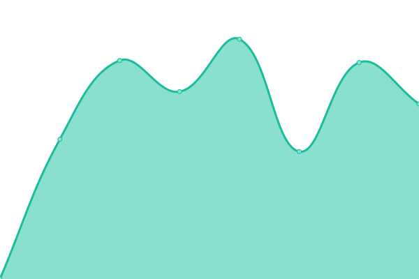

# [📈 Live Status](https://uptime.chadbourne.eu): <!--live status--> **🟩 All systems operational**

This repository contains the open-source uptime monitor and status page for [Kevin Chadbourne](https://uptime.chadbourne.eu), powered by [Upptime](https://github.com/upptime/upptime).

With [Upptime](https://upptime.js.org), you can get your own unlimited and free uptime monitor and status page, powered entirely by a GitHub repository. We use [Issues](https://github.com/chaddy314/upptime/issues) as incident reports, [Actions](https://github.com/chaddy314/upptime/actions) as uptime monitors, and [Pages](https://uptime.chadbourne.eu) for the status page.

<!--start: status pages-->
<!-- This summary is generated by Upptime (https://github.com/upptime/upptime) -->
<!-- Do not edit this manually, your changes will be overwritten -->
<!-- prettier-ignore -->
| URL | Status | History | Response Time | Uptime |
| --- | ------ | ------- | ------------- | ------ |
|  [Wikipedia](https://en.wikipedia.org) | 🟩 Up | [wikipedia.yml](https://github.com/chaddy314/upptime/commits/HEAD/history/wikipedia.yml) | 

 129ms
     
 | 

<a href="https://uptime.chadbourne.eu/history/wikipedia">100.00%</a>
    

|  Antares | 🟩 Up | [antares.yml](https://github.com/chaddy314/upptime/commits/HEAD/history/antares.yml) | 

 567ms
     
 | 

<a href="https://uptime.chadbourne.eu/history/antares">100.00%</a>
    

|  Leviathan | 🟩 Up | [leviathan.yml](https://github.com/chaddy314/upptime/commits/HEAD/history/leviathan.yml) | 

 486ms
     
 | 

<a href="https://uptime.chadbourne.eu/history/leviathan">100.00%</a>
    

|  Euclid | 🟩 Up | [euclid.yml](https://github.com/chaddy314/upptime/commits/HEAD/history/euclid.yml) | 

 1474ms
     
 | 

<a href="https://uptime.chadbourne.eu/history/euclid">100.00%</a>
    

|  Voyager | 🟩 Up | [voyager.yml](https://github.com/chaddy314/upptime/commits/HEAD/history/voyager.yml) | 

 1104ms
     
 | 

<a href="https://uptime.chadbourne.eu/history/voyager">100.00%</a>
    

|  Rigel | 🟩 Up | [rigel.yml](https://github.com/chaddy314/upptime/commits/HEAD/history/rigel.yml) | 

 724ms
     
 | 

<a href="https://uptime.chadbourne.eu/history/rigel">100.00%</a>
    

|  Prokyon | 🟩 Up | [prokyon.yml](https://github.com/chaddy314/upptime/commits/HEAD/history/prokyon.yml) | 

 1033ms
     
 | 

<a href="https://uptime.chadbourne.eu/history/prokyon">100.00%</a>
    

<!--end: status pages-->

[**Visit our status website →**](https://uptime.chadbourne.eu)

## 📄 License

- Powered by: [Upptime](https://github.com/upptime/upptime)
- Code: [MIT](./LICENSE) © [Anand Chowdhary](https://anandchowdhary.com), supported by [Pabio](https://pabio.com)
- Data in the `./history` directory: [Open Database License](https://opendatacommons.org/licenses/odbl/1-0/)
